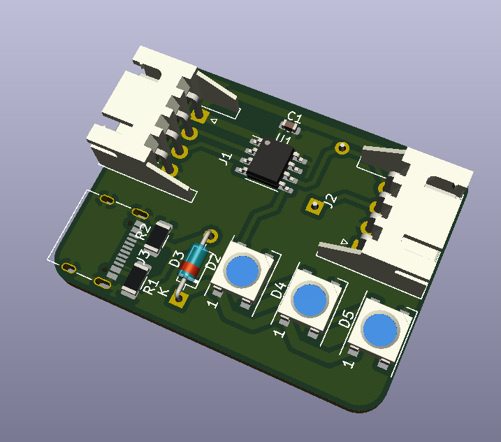
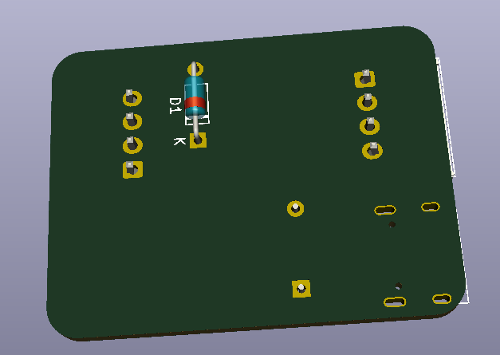

# KiCAD設計TA

回路設計における知識と技能を競いながら学びましょう．

---

## TA_01
[ATtiny402](https://akizukidenshi.com/goodsaffix/ATtiny202-204-402-404-406-DataSheet-DS40002318A.pdf)で[NeoPixel](https://akizukidenshi.com/goodsaffix/WS2812B_20200225.pdf)を3つ光らせる基板です．
ATtiny402には，NeoPixelを光らせる指令を受け取るためのUART(USART)と，プログラムを書き込むためのUPDIを取り付けましょう．

条件

    ・配線は1層のみ（リード部品の反転可）
    ・NeoPixelの電源はUSB typeC
    ・ATtinyはマイコン間通信用のUARTを用意すること
    ・基板外形の最大寸法は40x40mm^2
    ・タイマースタートはプロジェクトのSCHを開いた瞬間
    ・タイマーストップはJLCPCB用の製造ファイルをZipにまとめた瞬間

### 資料


### サンプル画像



---

## インストール方法

```bash
git clone https://github.com/Awattson/KiCAD_DTA.git
mkdir username_TA_01
cd username_TA_01
# KiCADのプロジェクトを作成して始めましょう
